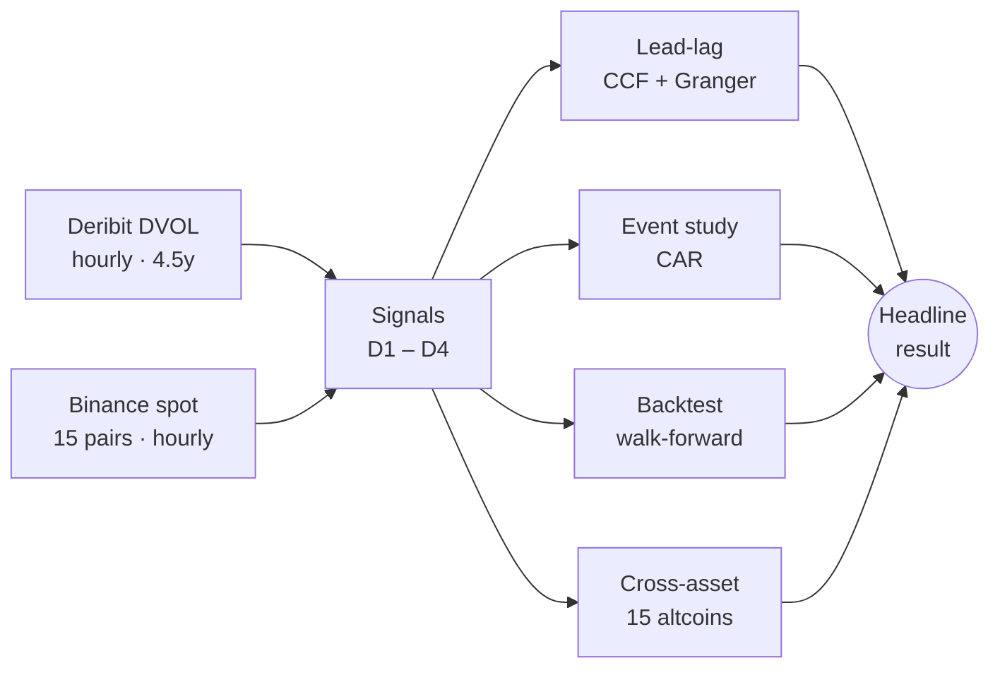

# Options-Implied Crypto Signals

[](https://github.com/TanvirCCC/options-implied-crypto-signals/actions/workflows/tests.yml)
[](LICENSE)
[](https://www.python.org/)
[](#data)

> Testing whether spikes in Deribit's BTC and ETH implied-volatility index (**DVOL**) front-run short-horizon moves in spot crypto returns. A quantitative research project on the lead-lag relationship between options and spot markets.

---

## Headline Result

| Strategy | OOS trades | OOS Sharpe | Walk-forward mean | WF range |
|----------|-----------:|-----------:|------------------:|----------|
| **ETH_D3_24h** &nbsp;·&nbsp; IV-risk-premium shock, 24h hold | **182** | **3.83** | **2.76** | −7.24 to +14.72 |

> ETH IV-risk-premium shocks show a promising short-horizon directional edge after correcting timing, signal, and metric issues, but the effect is **regime-dependent** and requires further conditioning before it can be treated as deployable alpha.


---

## What This Project Asks

Do sudden **DVOL spikes** — particularly unusual gaps between implied and realised volatility — carry directional information about spot prices in the next 1–24 hours?

If so, the options market is acting as a forward-looking signal for the spot market, consistent with informed traders expressing views through options before they show up in spot.

## Research Pipeline



| # | Notebook | What it does |
|---|----------|--------------|
| 01 | `01_data_exploration.ipynb` | Load DVOL + Binance spot, compute realised vol |
| 02 | `02_signals.ipynb` | Generate D1–D4 signals → `data/signals/` |
| 03 | `03_lead_lag.ipynb` | Cross-correlation, Granger causality, 2 placebos |
| 04 | `04_event_study.ipynb` | Cumulative abnormal returns around signal events |
| 05 | `05_backtest.ipynb` | 40 evaluated variants, walk-forward validation |
| 06 | `06_cross_asset.ipynb` | BTC DVOL → 15 altcoins propagation diagnostic |

## Signal Definitions

| Signal | Definition | Notes |
|--------|------------|-------|
| D1 | log-DVOL z-score > 2σ AND \|Δlog DVOL\| > 2% | Relative spike — failed Granger |
| D2 | \|Δlog DVOL\| ≥ 5% | Absolute shock — sparse (~20–25 events/yr) |
| **D3** | **IV-premium (DVOL − realised vol) z-score > 2σ** | **Headline signal — denser, stronger** |
| D4 | D1 conditions AND range z-score ≥ 1.5σ | Stricter D1 subset — raise threshold for selectivity |

24-hour cooldown applied to all signals to enforce event independence.

## Key Charts

**Event-study cumulative abnormal returns around ETH_D2 signals**


**Cross-asset propagation heatmap — BTC DVOL → 15 altcoins, by lag**


## Audit and Fix Cycle

This project was independently audited twice (by Codex GPT and Claude Opus 4.7) after the initial pass. **Four genuine bugs were found and fixed** before publishing the headline result:

| # | Bug | Fix |
|---|-----|-----|
| 1 | Backtest off-by-one — `holding_period=H` summed `H+1` return bars | `exit_pos = entry_pos + holding_period - 1` in `src/backtest.py` |
| 2 | Event-study `alpha` parameter ignored, bands hardcoded to 95% | `z = norm.ppf(1 - alpha/2)` in `src/event_study.py` |
| 3 | Sharpe annualised on event-trade returns with `sqrt(252)` — overstated by ~3–4× | Calendar-time hourly equity curve × `sqrt(8760)` in `src/metrics.py` |
| 4 | D4 identical to D1 in cached signals — range filter too loose | Z-score-based range filter in `src/signals.py` |

These fixes flipped the headline finding from ETH_D2 (sparse, walk-forward catastrophic) to **ETH_D3 (denser, walk-forward positive but volatile)**. The audit-and-fix cycle is documented openly as evidence of research process — the corrected story is both stronger and more honest than the first pass. Each bug has a dedicated regression test in `tests/`.

## Honest Limitations

- **Walk-forward dispersion is large.** Per-window OOS Sharpes for the headline strategy range from −7 to +15 across 13 windows. The signal works on average but is **regime-dependent**, not consistently profitable.
- **Cross-asset correlations are raw, not beta-adjusted.** Altcoins follow BTC, so a portion of "propagation" may be `BTC DVOL → BTC spot → alts`. Next step: regress alt returns on BTC contemporaneous and lagged returns and re-test on residuals.
- **D4 with current calibration filters only ~1% of D1 events.** Raise `signals.d4.range_multiplier` in `config.yaml` to 2.0–2.5 for a meaningfully stricter subset before drawing inference from D4.
- **No live execution simulation.** Costs include commission + slippage but not exchange spread, liquidity at scale, funding, or capacity constraints.

## Next Research Steps

The natural follow-up is **regime conditioning**, not more raw signal mining — identify when D3 works (volatility-trending markets? FOMC weeks? bear regimes?) and when it inverts. This is where the project moves from "interesting research signal" to "candidate deployable strategy."

## Quick Start

```bash
# install
pip install -r requirements.txt

# fetch ~30 MB of parquet data (free, public APIs — no account needed)
python download_data.py

# run all six notebooks in order
for nb in notebooks/0*.ipynb; do
  jupyter nbconvert --to notebook --execute --inplace "$nb"
done

# run the regression test suite
pytest tests/ -v
```

The tests pin all four audit-found bugs and run in under a second.

## Repository Layout

```
.
├── config.yaml                # All parameters in one place
├── pyproject.toml             # Package metadata + pytest config
├── download_data.py           # Fetch DVOL + Binance spot
├── src/
│   ├── deribit_fetch.py       # DVOL via Deribit API
│   ├── binance_fetch.py       # Binance public archive
│   ├── signals.py             # D1–D4 definitions
│   ├── lead_lag.py            # CCF, Granger, placebos
│   ├── event_study.py         # CAR analysis
│   ├── backtest.py            # Event-driven backtest, walk-forward
│   ├── metrics.py             # Hourly-equity Sharpe, Deflated Sharpe
│   └── cross_asset.py         # Propagation diagnostics
├── notebooks/                 # 01–06, run in order
├── tests/                     # 9 regression tests for audit-found bugs
├── data/                      # Mostly gitignored — large parquets
│   ├── deribit/  crypto/  signals/   (gitignored, fetched by download_data.py)
│   ├── plots/                 # Committed figures
│   └── results/               # Committed headline CSVs
├── archive/                   # Legacy code from the abandoned prediction-market design
├── .github/workflows/         # CI: pytest on every push
├── LICENSE                    # MIT
└── README.md
```

## Data

| Source | Symbols | Resolution | Range | Access |
|--------|---------|-----------:|-------|--------|
| Deribit DVOL | BTC, ETH | 1 h | 2022-01 → 2026-06 | Public API, no account |
| Binance spot | 15 USDT pairs | 1 h | 2022-01 → 2026-06 | Public archive, no account |

Total downloaded: ~30 MB across 17 parquet files. Cached locally, regenerable via `python download_data.py`.

## References

- Deribit DVOL — Deribit's implied-volatility index, analogous to the CBOE VIX
- Bailey & Lopez de Prado (2014) — *The Deflated Sharpe Ratio: Correcting for Selection Bias, Backtest Overfitting, and Non-Normality*
- Granger (1969) — *Investigating Causal Relations by Econometric Models and Cross-Spectral Methods*
- Kyle (1985) — *Continuous Auctions and Insider Trading*
- Bollerslev, Tauchen & Zhou (2009) — *Expected Stock Returns and Variance Risk Premia*

---

*Author: [Tanvir Chowdhury](https://github.com/TanvirCCC) · MSc Mathematical Trading and Finance, Bayes Business School*
