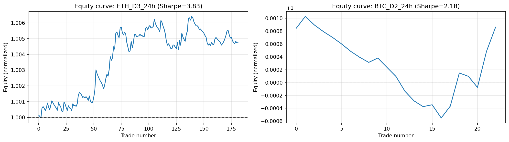
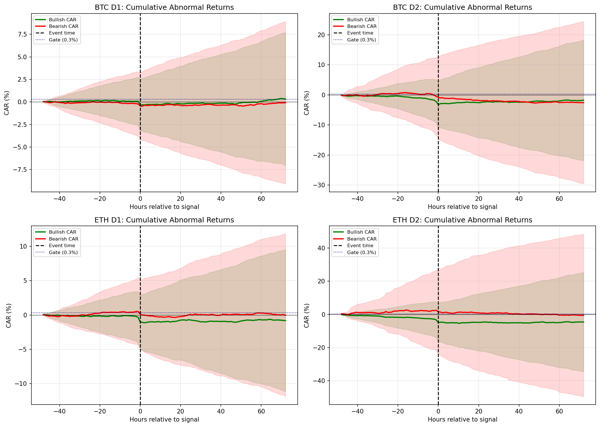
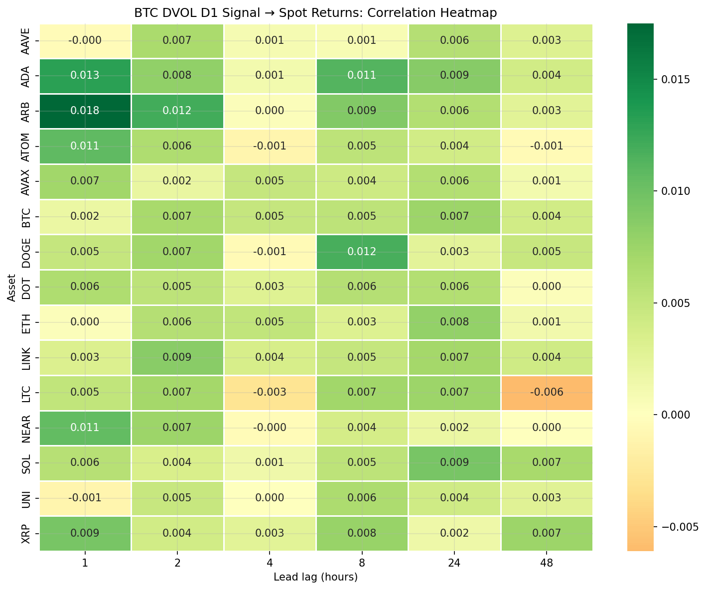

# Options-Implied Crypto Signals

Testing whether spikes in Deribit's BTC and ETH implied-volatility index (DVOL) front-run short-horizon moves in spot crypto returns.

## Research Question

Do sudden DVOL spikes — particularly unusual gaps between implied and realised volatility — carry directional information about spot prices in the next 1–24 hours? If so, the options market is acting as a forward-looking signal for the spot market, consistent with informed traders expressing views through options before they show up in spot.

## Headline Result

| Strategy | OOS trades | OOS Sharpe | Walk-forward mean | WF range |
|----------|-----------:|-----------:|------------------:|----------|
| **ETH_D3_24h** (IV-risk-premium shock, 24h hold) | 182 | 3.83 | 2.76 | −7.24 to +14.72 |

> ETH IV-risk-premium shocks show a promising short-horizon directional edge after correcting timing, signal, and metric issues, but the effect is regime-dependent and requires further conditioning before it can be treated as deployable alpha.

Headline metrics are saved as CSV in `data/results/`:
- `headline_metrics.csv` — single-row top-line summary
- `backtest_summary.csv` — test-set results across all 40 evaluated variants (2 currencies × 4 signals × 5 holding periods)
- `walkforward_ETH_D3_24h.csv` — per-window walk-forward Sharpes

## Key Charts

**Top-strategy equity curves (OOS test split):**



**Event-study cumulative abnormal returns around ETH_D2 signals:**



**Cross-asset propagation heatmap (BTC DVOL → 15 altcoins, by lag):**



## Pipeline

1. **`notebooks/01_data_exploration.ipynb`** — load DVOL + Binance spot, compute realised vol  
2. **`notebooks/02_signals.ipynb`** — generate D1–D4 signals to `data/signals/`  
3. **`notebooks/03_lead_lag.ipynb`** — cross-correlation, Granger causality, 2 placebos  
4. **`notebooks/04_event_study.ipynb`** — cumulative abnormal returns around signal events  
5. **`notebooks/05_backtest.ipynb`** — 40 evaluated variants (2 currencies × 4 signals × 5 holding periods), walk-forward  
6. **`notebooks/06_cross_asset.ipynb`** — BTC DVOL → 15 altcoins propagation diagnostic  

## Signal Definitions

| Signal | Definition | Notes |
|--------|-----------|-------|
| D1 | log-DVOL z-score > 2σ AND \|Δlog DVOL\| > 2% | Relative spike; failed Granger |
| D2 | \|Δlog DVOL\| ≥ 5% | Absolute shock; sparse (~20–25 events/yr) |
| **D3** | **IV-premium (DVOL − realised vol) z-score > 2σ** | **Headline signal — denser, stronger** |
| D4 | D1 conditions AND range z-score ≥ 1.5σ | Stricter D1 subset; raise threshold for selectivity |

24-hour cooldown applied to all signals to enforce event independence.

## Audit and Fix Cycle

This project was independently audited twice (by Codex GPT and Claude Opus 4.7) after the initial pass. Four genuine bugs were found and fixed before publishing the headline result:

1. **Backtest off-by-one** — `holding_period=H` was summing `H+1` return bars. Fixed in `src/backtest.py`.  
2. **Event-study confidence bands** — `alpha` parameter was accepted but ignored, bands hardcoded to 95%. Fixed in `src/event_study.py`.  
3. **Sharpe annualisation** — sparse event-trade returns were being annualised with `sqrt(252)`, overstating Sharpe by ~3–4×. Replaced with calendar-time hourly equity-curve returns × `sqrt(8760)` in `src/metrics.py`.  
4. **D4 ≡ D1** — original range filter was so loose that D4 was identical to D1 in cached signal files. Re-specified as a z-score-based range filter in `src/signals.py`.

These fixes flipped the headline finding from ETH_D2 (sparse, walk-forward catastrophic) to ETH_D3 (denser, walk-forward positive but volatile). The audit-and-fix cycle is documented here as evidence of research process, not hidden — the corrected story is both stronger and more honest than the first pass.

## Honest Limitations

- **Walk-forward dispersion is large.** Per-window OOS Sharpes for the headline strategy range from −7 to +15 across 13 windows. The signal works on average but is **regime-dependent**, not consistently profitable.  
- **Cross-asset correlations are raw, not beta-adjusted.** Altcoins follow BTC, so a portion of "propagation" may be: BTC DVOL → BTC spot → alts. A proper next step is regressing alt returns on BTC contemporaneous and lagged returns and re-testing on residuals.  
- **D4 with current calibration filters only ~1% of D1 events.** Raise `signals.d4.range_multiplier` in `config.yaml` to 2.0–2.5 to get a meaningfully stricter subset before drawing inference from D4.  
- **No live execution simulation.** Costs include commission + slippage but not exchange spread, liquidity at scale, funding, or capacity constraints.

## Next Research Steps

The natural follow-up is **regime conditioning**, not more raw signal mining. Identify when D3 works (volatility-trending markets? FOMC weeks? bear regimes?) and when it inverts. This is where the project moves from "interesting research signal" to "candidate deployable strategy."

## Repository Layout

```
.
├── config.yaml             # All parameters
├── download_data.py        # Fetch DVOL + Binance spot
├── src/
│   ├── deribit_fetch.py    # DVOL via Deribit API
│   ├── binance_fetch.py    # Binance public archive
│   ├── signals.py          # D1–D4 definitions
│   ├── lead_lag.py         # CCF, Granger, placebos
│   ├── event_study.py      # CAR analysis
│   ├── backtest.py         # Event-driven backtest, walk-forward
│   ├── metrics.py          # Hourly-equity Sharpe, Deflated Sharpe
│   └── cross_asset.py      # Propagation diagnostics
├── notebooks/              # 01–06, run in order
├── tests/                  # Regression tests for audit-found bugs
├── data/                   # Mostly gitignored (large parquets)
│   ├── deribit/            # DVOL parquets (gitignored, fetched by download_data.py)
│   ├── crypto/             # 15 Binance spot pairs (gitignored)
│   ├── signals/            # Cached D1–D4 outputs (gitignored)
│   ├── plots/              # Figures, committed
│   └── results/            # Headline CSVs, committed
├── archive/                # polymarket_fetch.py — legacy from the abandoned prediction-market design
├── LICENSE
└── README.md
```

## How to Run

```bash
pip install -r requirements.txt
python download_data.py              # if data/ is empty (~30 MB of parquets)
# run all six notebooks in order
for nb in notebooks/0*.ipynb; do
  jupyter nbconvert --to notebook --execute --inplace "$nb"
done
```

## Tests

Regression tests for the four audit-found bugs live in `tests/`:

```bash
pytest tests/ -v
```

Each test pins a specific failure mode from the audit cycle (backtest off-by-one, T+1 entry, D4 subset-of-D1, event-study `alpha` ignored). 9 tests; runs in ~1s.

## References

- Deribit DVOL — Deribit's implied-volatility index, analogous to the CBOE VIX
- Bailey & Lopez de Prado (2014) — *The Deflated Sharpe Ratio*
- Granger (1969) — *Investigating Causal Relations by Econometric Models and Cross-Spectral Methods*
- Kyle (1985) — *Continuous Auctions and Insider Trading*
- Bollerslev, Tauchen & Zhou (2009) — variance risk premium and equity returns
